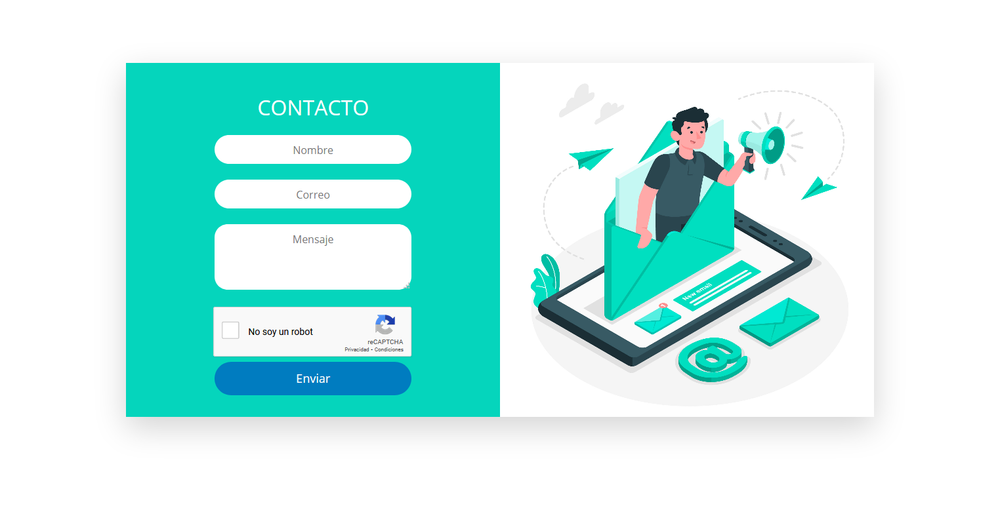

## Sistema Contacto Recaptcha v2

Recaptcha v2 utiliza la casilla de verificación, de igual manera genera un nuevo TOKEN cada 2 minutos, dejando que la casilla se genere de nuevo para que el usuario vuelva a seleccionarla y no tenga sospecha de que sea un robot.

- Screenshot

  
